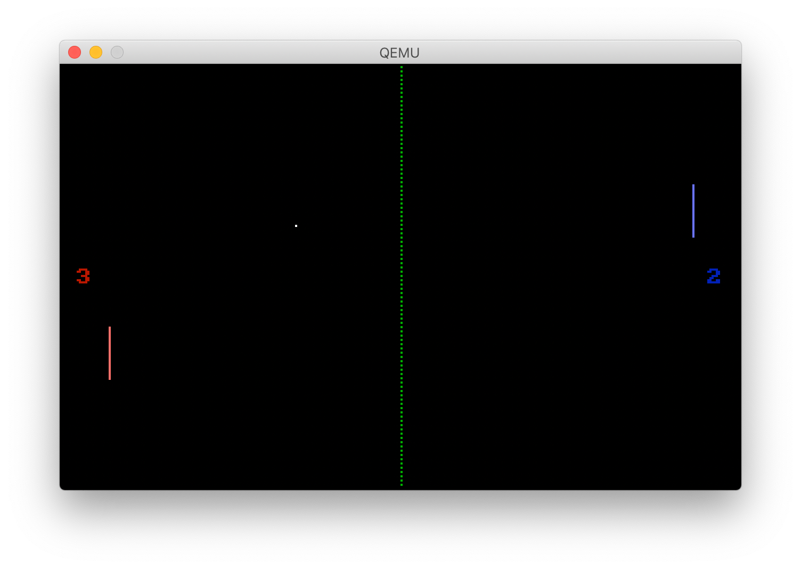

Bootloader Pong
===============
A small clone of the game Pong, written in x86 Assembly.

It is 441 bytes long, and fits completely within the 512 bytes of the x86 first-stage Boot Sector. It is entirely self-dependent, and does not need any Operating System to run. In fact, it can be burned onto a floppy, and booted from a genuine 386+ IBM PC with a VGA card. So metal.

    
See a full hex dump of the assembled machine code

~~~hexdump
00000000  b8 13 00 cd 10 b8 00 a0  8e c0 f7 1e a5 7d c7 06  |.............}..|
00000010  a1 7d a0 00 c7 06 a3 7d  64 00 e4 60 3c 11 74 06  |.}.....}d..`<.t.|
00000020  3c 1f 74 10 eb 1d a1 a9  7d 83 f8 00 74 15 ff 0e  |<.t.....}...t...|
00000030  a9 7d eb 0f a1 a9 7d 83  c0 19 3d c8 00 74 04 ff  |.}....}...=..t..|
00000040  06 a9 7d 8b 0e a1 7d 81  f9 df 00 7e 1f 8b 0e ac  |..}...}....~....|
00000050  7d 3b 0e a3 7d 7f 0b 83  c1 19 3b 0e a3 7d 7c 08  |};..}.....;..}|.|
00000060  eb 0a ff 0e ac 7d eb 04  ff 06 ac 7d a1 a1 7d 8b  |.....}.....}..}.|
00000070  1e a5 7d 01 d8 75 0f fe  06 ae 7d 80 3e ae 7d 0a  |..}..u....}.>.}.|
00000080  0f 8d de 00 eb 84 3d 40  01 75 10 fe 06 ab 7d 80  |......=@.u....}.|
00000090  3e ab 7d 0a 0f 8d ca 00  e9 6f ff 83 f8 17 75 13  |>.}......o....u.|
000000a0  8b 0e a9 7d 3b 0e a3 7d  7f 09 83 c1 19 3b 0e a3  |...};..}.....;..|
000000b0  7d 7d 18 3d 29 01 75 19  8b 0e ac 7d 3b 0e a3 7d  |}}.=).u....};..}|
000000c0  7f 0f 83 c1 19 3b 0e a3  7d 7c 06 f7 db 89 1e a5  |.....;..}|......|
000000d0  7d a3 a1 7d a1 a3 7d 8b  1e a7 7d 01 d8 74 05 3d  |}..}..}...}..t.=|
000000e0  c8 00 75 06 f7 db 89 1e  a7 7d a3 a3 7d b1 00 bf  |..u......}..}...|
000000f0  00 fa 26 88 0d 4f 75 fa  b8 01 00 bb a0 00 b9 63  |..&..Ou........c|
00000100  00 b2 02 e8 76 00 83 c0  02 e2 f8 b2 01 b6 0c b3  |....v...........|
00000110  04 a0 ab 7d 04 30 e8 71  00 b2 26 b6 0c b3 01 a0  |...}.0.q..&.....|
00000120  ae 7d 04 30 e8 63 00 a1  a9 7d bb 17 00 b9 19 00  |.}.0.c...}......|
00000130  b2 0c e8 47 00 40 e2 fa  a1 ac 7d bb 29 01 b9 19  |...G.@....}.)...|
00000140  00 b2 09 e8 36 00 40 e2  fa a1 a3 7d 8b 1e a1 7d  |....6.@....}...}|
00000150  b2 0f e8 27 00 b4 86 b9  00 00 ba 00 20 cd 15 e9  |...'........ ...|
00000160  b8 fe bf af 7d b9 0a 00  b2 0f b6 0c b3 0a 8a 05  |....}...........|
00000170  51 e8 16 00 fe c2 47 59  e2 f4 eb fe 50 69 c0 40  |Q.....GY....Pi.@|
00000180  01 01 d8 89 c7 26 88 15  58 c3 3c 20 74 12 b7 00  |.....&..X.< t...|
00000190  50 53 b8 00 02 cd 10 5b  58 b4 0a b9 01 00 cd 10  |PS.....[X.......|
000001a0  c3 a0 00 64 00 01 00 01  00 57 00 00 57 00 00 47  |...d.....W..W..G|
000001b0  41 4d 45 20 20 4f 56 45  52 00 00 00 00 00 00 00  |AME  OVER.......|
000001c0  00 00 00 00 00 00 00 00  00 00 00 00 00 00 00 00  |................|
000001d0  00 00 00 00 00 00 00 00  00 00 00 00 00 00 00 00  |................|
000001e0  00 00 00 00 00 00 00 00  00 00 00 00 00 00 00 00  |................|
000001f0  00 00 00 00 00 00 00 00  00 00 00 00 00 00 55 aa  |..............U.|
~~~

The game
--------

Move your red paddle up and down with the `W` and `S` keys. Challenge the AI in a match to 10 points.

Features
--------

- [x] Beautiful 320x200 graphics
- [x] A challenging but beatable AI
- [x] Game-over state and screen
- [x] Player scores and victory conditions
- [ ] Start a new match without rebooting
- [ ] Dirty-tracking for flicker-free animation
- [ ] An intro screen
- [ ] Sound

Getting the source and the pre-built binary
-------------------------------------------
Sources ship with a pre-built x86_64 binary image, so you don't have to compile anything.

~~~sh
$ git clone https://github.com/zenoamaro/bootloader-pong
$ cd bootloader-pong
~~~

Running in QEMU
---------------
If you want to test the image, but don't want to reboot your PC, or if you're developing, the easiest way to do so is by using QEMU. You can also use virtualization software, like VirtualBox, if you prefer.

~~~sh
$ apt install qemu   # Install on Debian Linux
$ brew install qemu  # Install on MacOS

$ make run  # Boots the image
~~~

Burning onto a floppy
---------------------
Replace `/dev/fd0` with the correct identifier for your Floppy Disk or USB device. Once burned, simply reboot your machine, and choose to boot from that device.

~~~sh
$ dd if=/dev/zero of=/dev/fd0 bs=1024 count=1440  # Erase the disk
$ dd if=dist/pong.img of=/dev/fd0                 # Burn the image
~~~

Development
-----------
If you want to play around, get NASM and QEMU, so you can develop and test locally.

~~~sh
$ apt install nasm qemu   # Install on Debian Linux
$ brew install nasm qemu  # Install on MacOS

$ make      # To build
$ make run  # To build and run
~~~

The source code is probably not the best, as my assembly skills are quite primitive. There are certainly many low-hanging opportunities for optimization and byte-shaving. Contributions are welcome.

The source is structured this way:

|              |                                                            |
|--------------|------------------------------------------------------------|
| `main.asm`   | Entry point, includes every other file                     |
| `data.asm`   | constant and data declarations                             |
| `setup.asm`  | setup video mode, addressing                               |
| `loop.asm`   | main game loop, coordinates game state, updates, rendering |
| `update.asm` | updates game entities each frame                           |
| `draw.asm`   | renders game entities to screen each frame                 |
| `utils.asm`  | utility functions                                          |

License
-------
Licensed under the MIT License.

Copyright (c) 2019, zenoamaro <zenoamaro@gmail.com>
